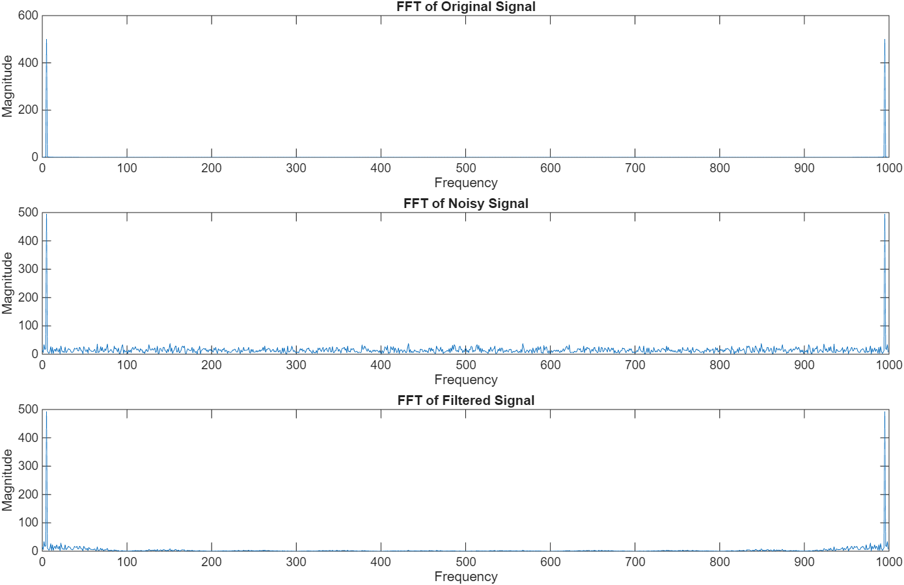

# Noise Removal using Moving Average Filter

## Objective
To remove noise from a signal using a moving average filter.

## Methodology
1. Generate sine wave signal
2. Add Gaussian noise
3. Apply moving average filter
4. Analyze in time and frequency domain (FFT)

## Tools Used
- MATLAB

## Results
Noise is reduced and signal becomes smoother after filtering.

## Output

### Time Domain
![Time Domain]https://github.com/Aunnitya/DSP-Project/blob/54e24a4e8c6b8a0027c590565b2583830c652a06/%20time_domain.png

### Frequency Domain

## Author
Aunnitya

